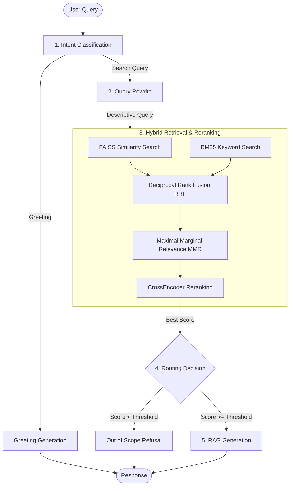

# ⚡ RAG Intelligence Chatbot

A state-of-the-art, high-performance **Retrieval-Augmented Generation (RAG)** chatbot engineered with **Hybrid Search**, **Neural Reranking**, and **LLM-driven Scope Routing**. Powered by the blazing-fast **Groq Cloud API** and featuring deep execution tracing via the `smartllmops` logging framework, all wrapped in a premium, glassmorphism-inspired Streamlit interface.

---

## 📐 System Architecture

The chatbot utilizes an advanced multi-stage pipeline to classify user intent, fetch relevant knowledge, route inquiries, and synthesize precise, factual responses.



---

## 🚀 Key Features

*   **Intent Classification:** Dynamically routes simple greeting queries directly to lightweight prompts, saving computing overhead.
*   **Query Rewriting:** Automatically reformulates complex user inquiries into optimized search phrases using LLM context to maximize retrieval hit rate.
*   **Hybrid Search & Fusion:**
    *   **Vector Search:** Semantically retrieves document chunks from a local **FAISS** index using high-quality embeddings.
    *   **Keyword Search:** Utilizes a custom-built **BM25 Index** for exact keyword and term matching.
    *   **Reciprocal Rank Fusion (RRF):** Blends vector and BM25 candidate ranks for robust hybrid document selection.
    *   **Maximal Marginal Relevance (MMR):** Enforces high diversity across retrieved candidate documents to prevent redundant context.
*   **Neural Reranking:** Applies a **CrossEncoder model** (`ms-marco-MiniLM-L-6-v2`) over candidate documents to score exact query-to-document relevance.
*   **Hierarchical (Parent-Child) Chunking:** Performs precise retrieval on small child chunks (250 tokens) but passes wider parent context (800 tokens) to the LLM for high-fidelity responses.
*   **Failsafe Routing Gateways:** Rejects out-of-scope inputs with elegant, concise refusals based on reranker scores and raw vector store confidence.
*   **Real-time Tracing:** Integrated with `smartllmops` logging decorators (`@smart_trace`) to audit execution timing, token usage, routing metrics, and retrieved documents.

---

## 🛠️ Technology Stack & Libraries

### Core App & UI
*   **Streamlit (v1.45.0):** Responsive web interface featuring tailored CSS styled with Outfit typography, clean glassmorphism sidebar containers, and custom chat bubbles.
*   **Pandas (v2.2.3):** Structured data manipulation and CSV document parsing.

### LLM Inference
*   **Groq Cloud API:** Blazing-fast inference utilizing open weights models like `llama-3.3-70b-versatile` and `llama-3.1-8b-instant`.
*   **LangChain Groq (v1.1.2):** Standardized interface for integrating ChatGroq models.

### Embeddings & Vector Stores
*   **FAISS CPU (v1.13.2):** High-speed local vector database implementing `MAX_INNER_PRODUCT` distance strategy for semantic queries.
*   **HuggingFace Embeddings (`all-MiniLM-L6-v2`):** Generates normalized, 384-dimensional dense semantic vectors on local CPU.

### Search & Neural Reranking
*   **Rank BM25 (v0.2.2):** Keyword matching index created dynamically from docstores.
*   **Sentence-Transformers (v5.5.0):** Cross-encoder modeling for neural relevance reranking.

### Parsers & Helpers
*   **PyPDF (v6.11.0):** Consistent extraction of text and formatting from PDF files.
*   **TikToken (v0.13.0):** Tokenizer for safe context window truncation.

### Telemetry & MLOps
*   **smartllmops:** Native execution logging and centralized tracing platform integration.

---

## 💻 Installation & Setup

Follow these steps to set up and run the chatbot on your local machine:

### 1. Git Clone the Repository
Clone the codebase and navigate to the project directory:
```bash
git clone https://github.com/jayantvasa7280/RAG-Chatbot-using-Groq.git
cd RAG-Chatbot-using-Groq
```

### 2. Configure Environment Variables
Copy the template `.env.example` file to create your active `.env` file:
```bash
cp .env.example .env
```

### 3. Setup Your Secrets & Keys
Open the newly created `.env` file in your editor and fill in your actual credentials:
```env
GROQ_API_KEY=your_actual_groq_api_key_here
COSMOS_CONN_WRITE="AccountEndpoint=https://your-cosmos-db-account.documents.azure.com:443/;AccountKey=your_write_key_here;"
COSMOS_DB="database-name"
COSMOS_CONTAINER="container-name"
AZURE_COSMOS_DISABLE_SSL_VERIFICATION=true
```

### 4. Create a Virtual Environment
Create a clean Python virtual environment to isolate the project dependencies:
```bash
python3 -m venv .venv
```

### 5. Activate and Install Requirements
Activate the virtual environment and install all necessary packages from `requirements.txt`:
```bash
source .venv/bin/activate && pip install -r requirements.txt
```
*(This command will automatically download and install the customized version of the `smartllmops` logging library directly from the GitHub repository).*

### 6. Run the Chatbot
Launch the Streamlit web engine:
```bash
streamlit run app.py
```
Your default browser will automatically open to `http://localhost:8501`.

---

## 📂 Document Processing Workflow

To feed your custom documents into the chatbot:
1. Put your custom `.pdf`, `.txt`, or `.csv` files into the sidebar file uploader.
2. Click **Process & Index Files** to segment, vectorize, and commit the documents to the local FAISS index on disk.
3. Click **Reload Engine** to refresh the server cache and immediately begin querying your new knowledge base!
